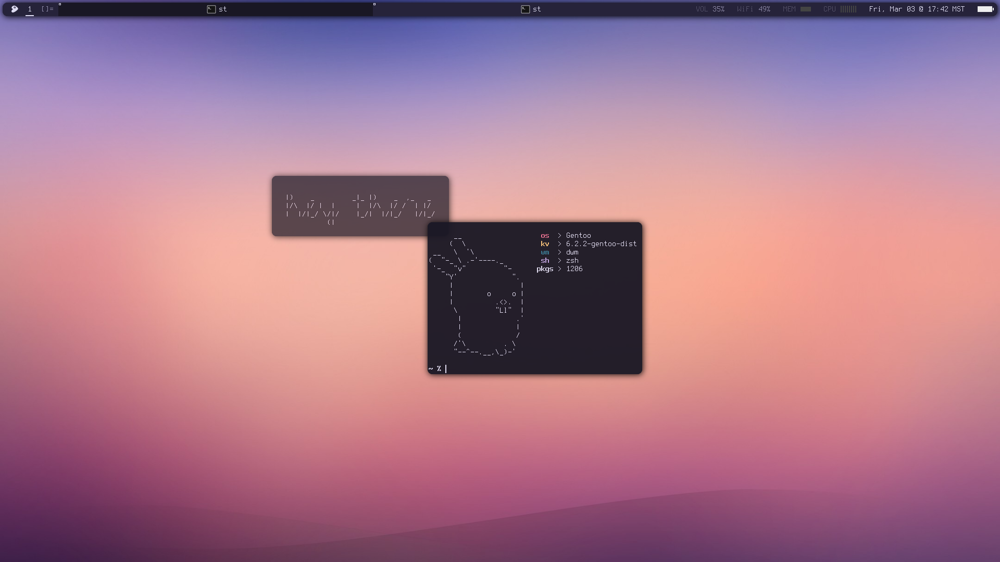
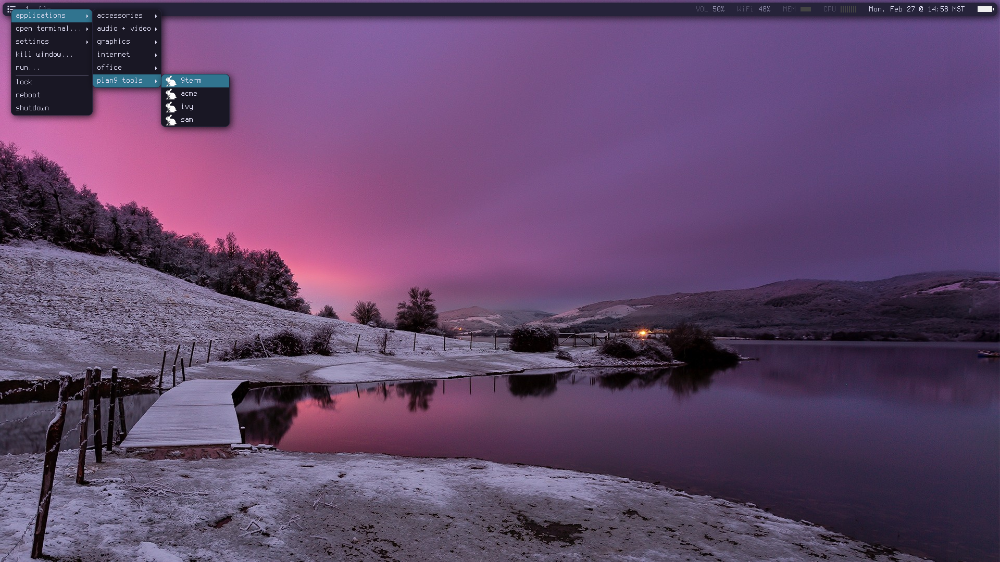
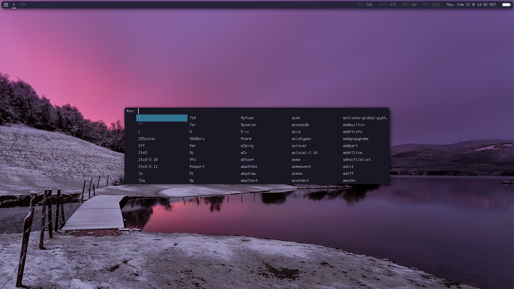
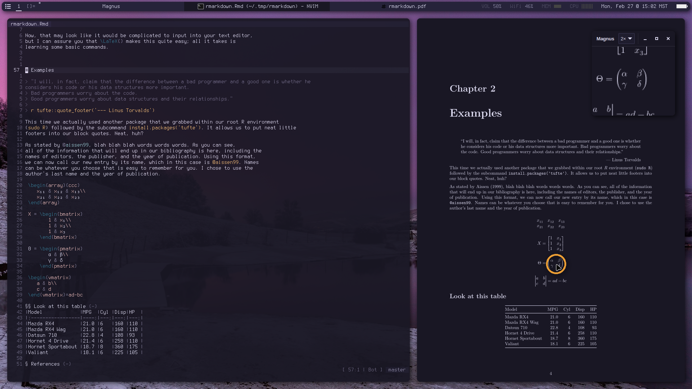

Overview
========

Personal builds of the suckless suite of tools.

Functionality is not guaranteed.

Patches
=======

* dwm

  * actualfullscreen

  * alttab

  * alwayscenter

  * awesomebar

  * barpadding

  * centeredwindowname

  * dragcfact (smooth) + dragmfact (smooth)

  * focusmaster

  * focusonclick

  * hidevacanttags

  * killunsel

  * layoutmenu

  * movekeyboard

  * pertag

  * preserveonrestart

  * quitprompt

  * rainbowtags

  * resizepoint

  * riodraw

  * savefloats

  * scratchpads

  * status2d

  * statusbutton

  * statuspadding

  * sticky + stickyindicator

  * swallow

  * underlinetags

  * unicodeellipsis

  * vanitygaps

  * winicon

  * zerodepthsafeguard

* dmenu

  * barheight

  * barpadding

  * borderoption

  * center

  * coloredcaret

  * fuzzyhighlight + fuzzymatch

  * grid + gridnav

  * password

  * promptcolor

  * unicodeellipsis

* st

  * boxdraw

  * desktopentry

  * font2

  * ligatures

  * netwmicon

* tools

  * sent

    * invertedcolors

    * pdf

    * togglescm

  * slock

    * foreground and background

  * tabbed

    * clientnumbers

    * icon

    * moveclamped

    * xft
